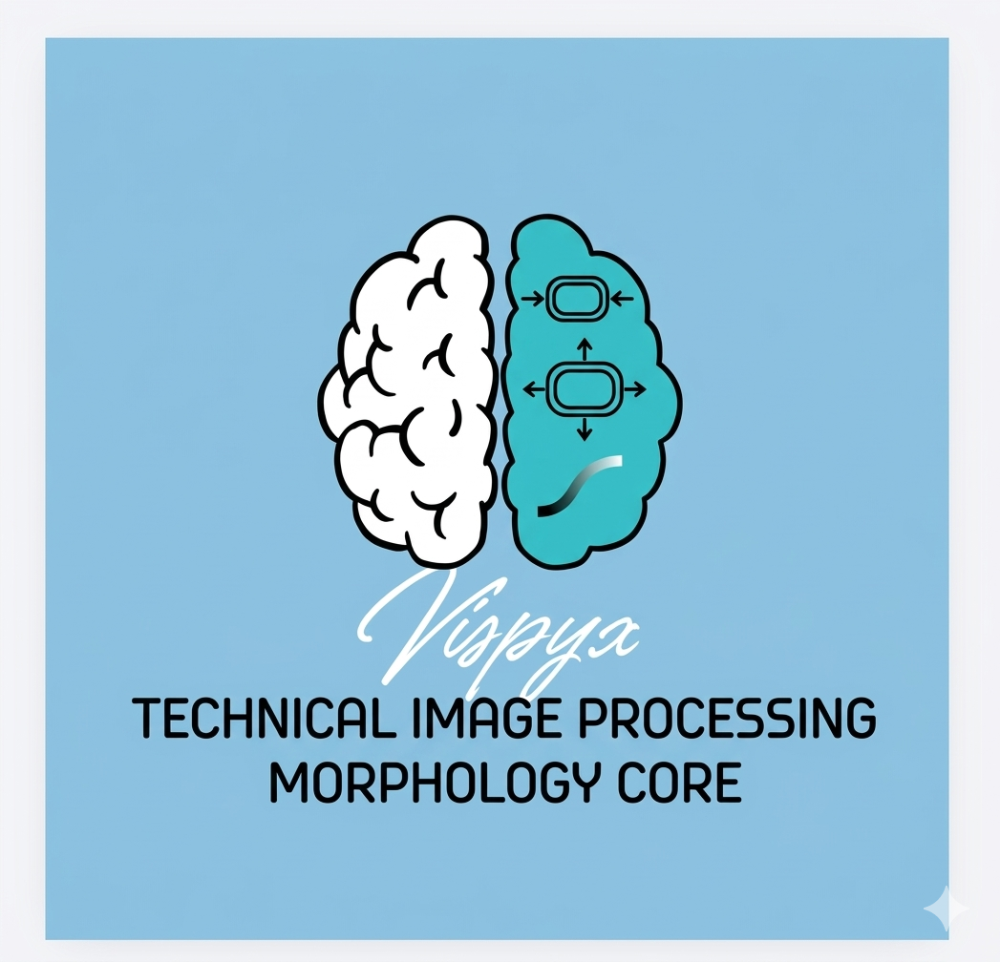

<p align="center">
  
</p>

<h1 align="center">vispyx</h1>

<p align="center">
  Technical image processing with a morphology core implemented from scratch.
</p>

`vispyx` es un paquete de procesamiento de imágenes en Python, orientado a flujos de trabajo técnicos (médico, industrial y científico), con énfasis en **morfología implementada desde cero**.

## Características

- Preprocesamiento de contraste con `CLAHE`
- Segmentación binaria con umbral de `Otsu`
- Morfología binaria implementada desde cero (`vpx_*`):
  - `vpx_erode`
  - `vpx_dilate`
  - `vpx_open`
  - `vpx_close`
  - `vpx_gradient`
  - `vpx_tophat`
  - `vpx_blackhat`
  - `vpx_boundary`
  - `vpx_hitmiss`
- Morfología en escala de grises (`gray_*`):
  - `gray_erode`
  - `gray_dilate`
  - `gray_open`
  - `gray_close`
- Generadores formales de kernels:
  - `kernel_square`
  - `kernel_cross`
  - `kernel_diamond`
  - `kernel_disk`
- CLI para ejecutar pipelines sin escribir código
- API pública limpia desde `vispyx`

## Estado del Proyecto

Versión actual: `0.1.0`  
Enfoque actual: estabilización de core de procesamiento y calidad de interfaz/uso.

## Requisitos

- Python `>= 3.7`
- Dependencias principales:
  - `opencv-python`
  - `numpy`
  - `scikit-image`
  - `matplotlib`

## Instalación

```bash
pip install -e .
```

## Uso por CLI

Sintaxis general:

```bash
vispyx <method> <image_path> [flags]
```

Métodos disponibles:

- `clahe`
- `otsu`
- `vpx_erode`
- `vpx_dilate`
- `vpx_open`
- `vpx_close`
- `vpx_gradient`
- `vpx_tophat`
- `vpx_blackhat`
- `vpx_boundary`

Ejemplos:

```bash
# CLAHE
vispyx clahe archive/all-mias/mdb001.pgm --clip 3.0 --grid 8 --output outputs/mdb001_clahe.pgm

# Otsu
vispyx otsu archive/all-mias/mdb001.pgm --output outputs/mdb001_otsu.pgm

# Morfología desde cero (alias --kernel)
vispyx vpx_erode archive/all-mias/mdb001.pgm --kernel 5 --iterations 2 --output outputs/mdb001_erode.pgm
```

## Uso por API (Python)

```python
from vispyx import (
    apply_clahe,
    gray_close,
    kernel_disk,
    read_grayscale,
    segment_otsu,
    vpx_open,
)

img = read_grayscale("archive/all-mias/mdb001.pgm")
clahe = apply_clahe(img, clip_limit=3.0, tile_grid_size=(8, 8))
smoothed = gray_close(clahe, kernel=kernel_disk(1))
binary = segment_otsu(smoothed)
clean_mask = vpx_open(binary, kernel=kernel_disk(1), iterations=1)
```

## Guías de Uso

- Documentación general: [docs/README.md](./docs/README.md)
- Morfología binaria: [docs/binary_morphology_usage.md](./docs/binary_morphology_usage.md)
- Morfología en escala de grises: [docs/grayscale_morphology_usage.md](./docs/grayscale_morphology_usage.md)
- API pública y kernels: [docs/public_api_and_kernels.md](./docs/public_api_and_kernels.md)

## Estructura

```text
vispyx/
├── vispyx/
│   ├── __init__.py
│   ├── cli.py
│   ├── kernels.py
│   ├── preprocessing.py
│   ├── segmentation.py
│   ├── morphology.py
│   └── utils.py
├── test/
├── examples/
└── docs/
```

## Testing

```bash
pytest -q
```

## Licencia

MIT License. Ver [LICENSE](./LICENSE).
